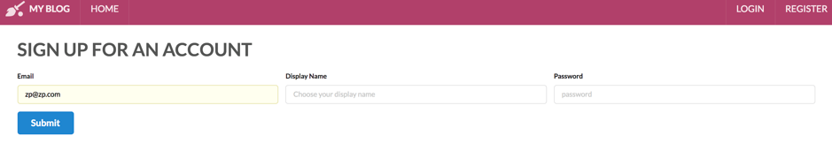
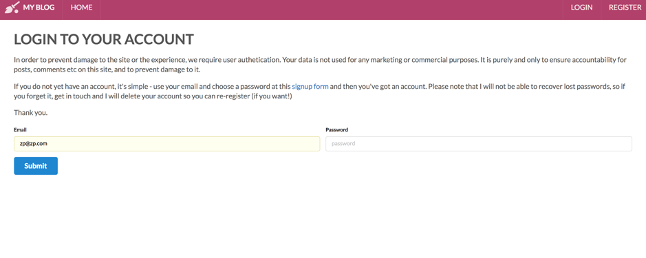
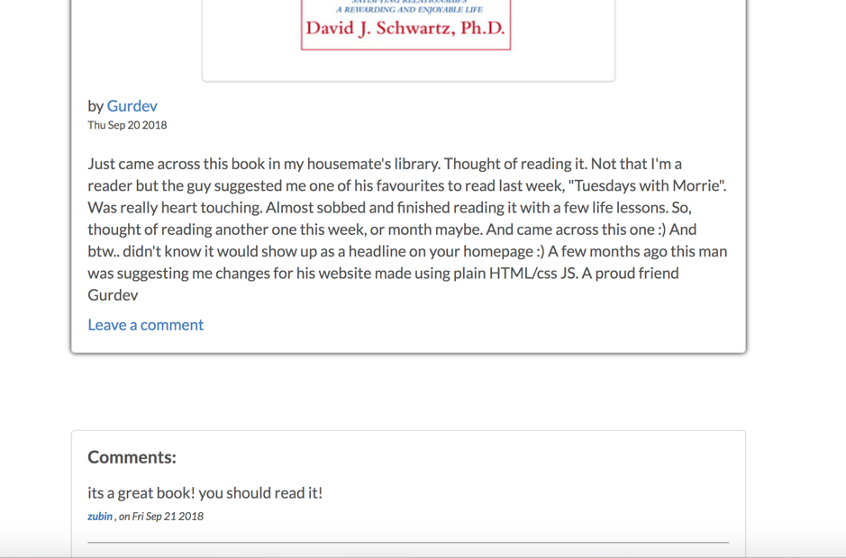
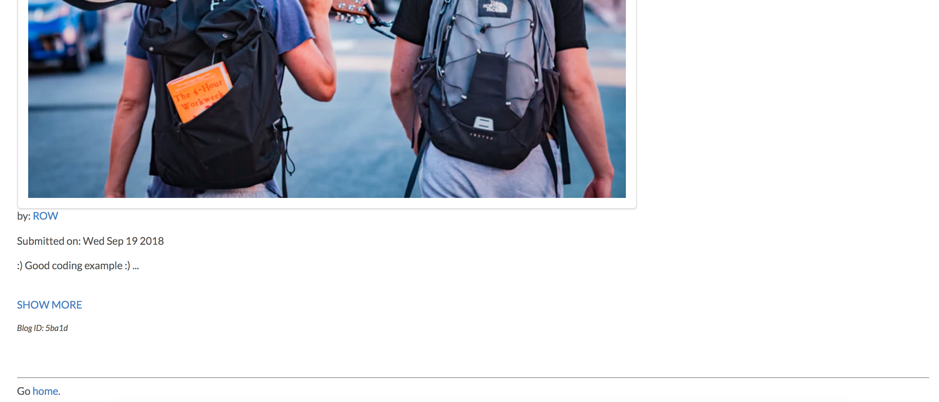
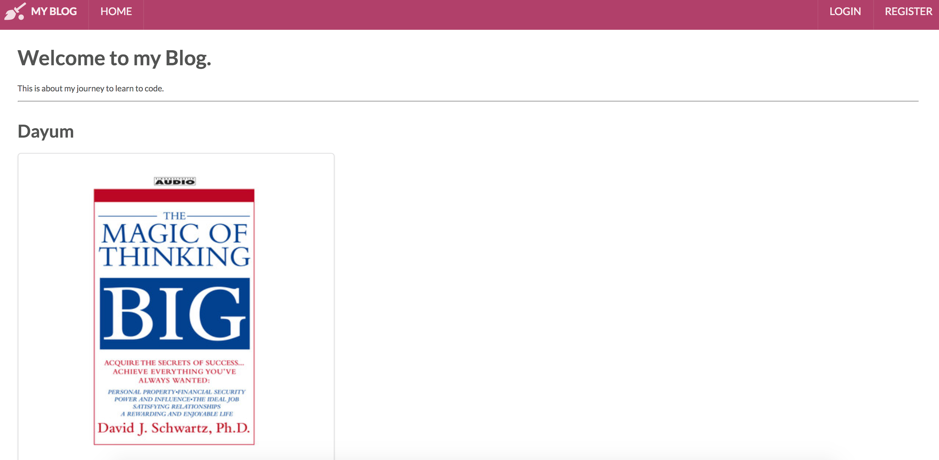
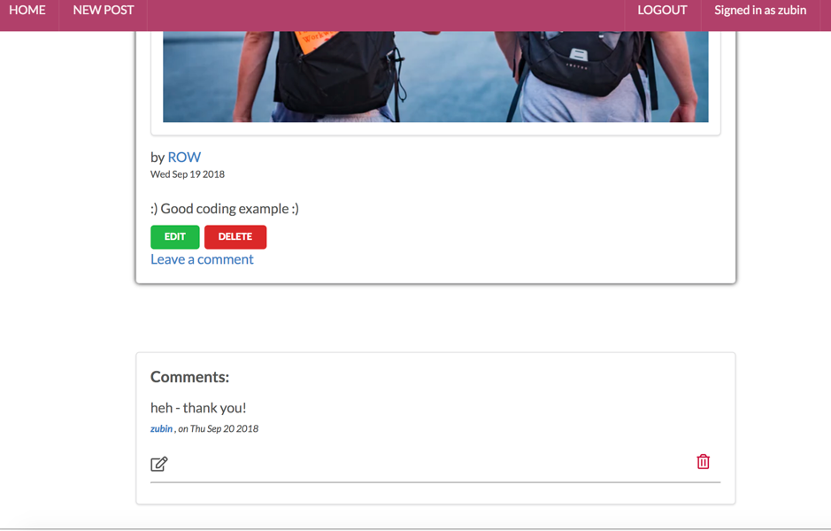

# blog-webdev-bootcamp

Each set of exercises / topics falls in its own branch.  switch branches to see code by topic.

**_Note_**:  there are several projects (in their branch) and the showcase project is afull stack CRUD blog webapp, and  is  in the deploymentAndRouters branch, and merged into master.

# STACK DESCRIPTION
1) built in html, JS, with a node express backend, dynamically rendered with data from the DB
2) Node Passport backend
3) Mongoose, MongoDB for database
4) Heroku deployment
5) Semantic-UI styling
6) RESTful routing conventions

# FUNCTIONALITY
1) REGISTRATION page
2) LOGIN page
3) Blogs page, ordered with latest on top
4) EDIT and DELETE functionality only for authors of the Post
5) EDIT and DELETE functionality only for authors of the Comment
6) Login is required to edit, or delete, but not to read individual blog (SHOW MORE)
7) add new picture and edit existing picture or post functions

# SCREENSHOTS
1) __REGISTER / SIGNUP__

2) __LOGIN__

3) __Comments + Post Without Edit Functionality__

4) __Main page with SHOW MORE link__

5) __NavBar with Main Page & Picture Functionality__

6) __Edit & Delete Functionality - only for logged in && author__

